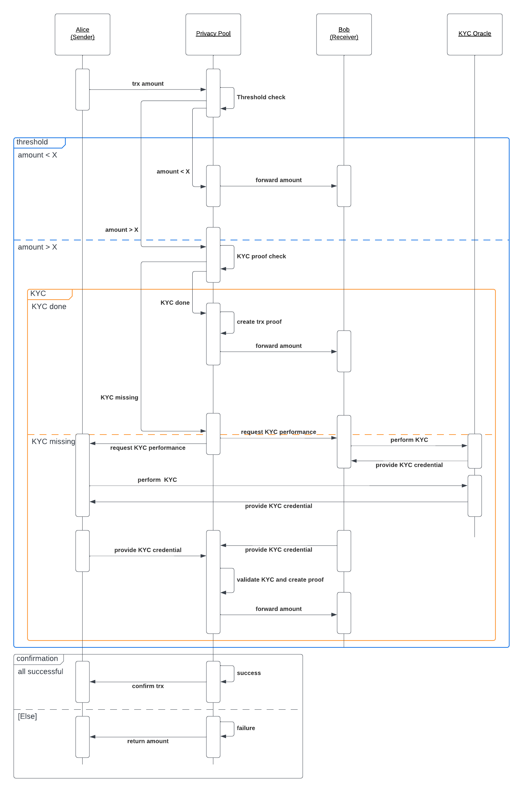

# PP-PP 
Polkadot Privacy-preserving Payments

> Don't remove any of the mandatory parts presented in bold letters or as headlines (except for the title)! Lines starting with a `>` (such as this one) should be removed. 
>
> See the [Process](https://github.com/pioneersprize/Guidelines#7-process) on how to submit a proposal.
- **Team Name:** etonec GmbH
- **Payment Address:** 15xz5ASrvxrvxCpL9jMwXYF7f4KJri3NKNcYEmP74AvLyJSr 

> :exclamation: *The combination of your GitHub account submitting the application and the payment address above will be your unique identifier during the program. Please keep them safe.*
## Project Overview :page_facing_up:

### Overview

Please provide the following:

- If the name of your project is not descriptive, a tagline (one sentence summary).
  We bring privacy-preserving and regulatory compliant payments to the Polkadot ecosystem
  
- A brief description of your project.
  We seek to bring the two - often perceived as conflicting - concepts of highest privacy for users and regulatory compliance to the Polkadot ecosystem. Highest privacy and compliance is achieved by using self-sovereign identity (SSI)  technologies for know-your-customer (KYC) attestations as well as zero-knowledge proofs (ZKPs).
As part of this grant, we seek to build a “privacy pool” on Polkadot, where users can conduct privacy-preserving, yet compliant, payments. To ensure compliance, we integrate the necessity of specific users to identify themself, i.e., to undergo a KYC process. While it will provide an exciting avenue for future work, note that sanction checks and further anti-money laundering efforts are outside the scope of this grant:
In detail the privacy pool works as follows:
- Small-volume payments: If payment amount < specific threshold (e.g. specified by regulation): payment is conducted privately without the necessity of KYC
- Large-volume payments: If payment amount > specific threshold: KYC is necessary to conduct a payment. Here, we integrate with market-leading KYC providers, orchestrate the received KYC data and issue an SSI credential/KYC attestation to the user. Then, we share a ZKP included in that credential that proves that a user has conducted KYC (signed by us). Subsequently, the user can continue with conducting a privacy-preserving payment. Of course, the KYC information is not visible on-chain - only the proof is stored in the credential in the users’ wallet.
- Note that for both small-volume and large-volume payments the link between sender and recipient is not publicly visible on chain 

Our solution is based on a user-centric design, where both attestations and proofs are stored on the user’s end device - the user always decides which data to share with whom.

Our solution works as follows: We set up a privacy pool (smart contract / escrow account) on a parachain. In this privacy pool, users can deposit and withdraw funds - but the link between the sender and receiver is not not visible, thereby preserving privacy. 

Let’s assume that Alice would like to send money to Bob privately via a parachain. Alice would then deposit money into the privacy pool. As a next step, Bob would withdraw the money from the privacy pool. Assuming that a sufficient number of people deposit money into the privacy pool, the link between sender and receiver is not visible. This protects the privacy of users.
  
- An indication of how your project relates to / integrates into Polkadot.
  Users can conduct privacy pool transactions via a parachain (more details below). To conduct a payment, the users need a respective wallet. Note that we will develop a PoC demo wallet for illustrative purposes only.

- An indication of why your team is interested in creating this project.
  Etonec is a venture building and prototyping company at the intersection of traditional payments and traditional assets with a focus on privacy-preserving technologies. Etonec has successfully developed > 10 venture platform MVPs and has years of experience around digital identities, regulation, as well as ZKPs. Website: [https://www.etonec.com/](https://www.etonec.com/)
 
We have built out a privacy-preserving payments prototype on the Mina Protocol and are currently building a similar construct on another leading ZK protocol. You find the GitHub repository for the Mina prototype here: https://github.com/etoneclab/cash-like-mina. 

We would be thrilled to bring a similar solution to the Polkadot ecosystem as part of this grant

### Project Details

We expect the teams to already have a solid idea about your project's expected final state. Therefore, we ask the teams to submit (where relevant):

- Mockups/designs of any UI components
  Video of [Mina Prototype](https://docsend.com/view/tey64zyjsquvh3x9). Note that the branding will be changed to capture the Polkadot logo as well as further corporate identity elements.

- Data models / API specifications of the core functionality
  [Mina prototype documentation](https://github.com/etoneclab/cash-like-mina)
- An overview of the technology stack to be used
  We use the following technologies:
    - Development of back-end with Node JS and rust
    - Development of smart contract via Substrate and ink!
    - Front-end development with react JS
    - Design with Figma
    - DLT: Parachain via Polkadot relay-chain 
    - Project management and QA testing using Monday 

- Documentation of core components, protocols, architecture, etc. to be deployed
  
  
- PoC/MVP or other relevant prior work or research on the topic
    * [Feasibility Study on privacy-preserving and compliant stablecoin payments](https://93a3941f-39f9-4f04-8f5f-15c3ed543589.usrfiles.com/ugd/93a394_7711957ee94e44598e6580ab7baa2ce0.pdf)
  * [Github for Mina PoC](https://github.com/etoneclab/cash-like-mina)
  * [Video for Mina PoC](https://docsend.com/view/tey64zyjsquvh3x9)

- What your project is _not_ or will _not_ provide or implement
  We only provide a demo wallet and not a fully-fledged wallet solution for privacy pool payments

- This is a place for you to manage expectations and to clarify any limitations that might not be obvious

Things that shouldn’t be part of the application:
- The (future) tokenomics of your project 
- For non-infrastructure projects—deployment and hosting costs, maintenance or audits
- Business-oriented activities (marketing, business planning), events or outreach

### Ecosystem Fit

Help us locate your project in the Polkadot/Substrate/Kusama landscape and what problems it tries to solve by answering each of these questions:

- Where and how does your project fit into the ecosystem?
  In contrast to existing blockchains, Polkadot enables participants to set up parachains via their SDK/code environment Substrate, i.e., their own L1s depending on their needs and use cases. This approach provides great flexibility and customization. Today, there are various parachains that have a focus on identity, such as Dock or Kilt, or on privacy, such as Raze or Manta. We think that the best environment to implement our privacy pool construct are either existing privacy or identity parachains.

  Note that the privacy pool will be set up as a smart contract where participants can send or receive money upon specific conditions. So, it needs to be implemented on a parachain that has smart contract capabilities. One key feature of the privacy pool is that the link between the sender and the receiver is broken, thereby preserving privacy, while considering regulatory requirements, e.g., around KYC.
  
  For full functionality, a wallet is required that - besides token transfers - also allows the storage of credentials, e.g., KYC credentials. Note that we will provide only a wallet for demo purposes.

- Who is your target audience (parachain/dapp/wallet/UI developers, designers, your own user base, some dapp's userbase, yourself)?
  We see our solution as a vital part to enable privacy-preserving and compliant transfers in the Polkadot ecosystem. Our target audience are parachains that seek to provide a flourishing environment for privacy-preserving but compliant applications. Further, our solution will also be available for general developers that seek to build respective applications.

- What need(s) does your project meet?
   In a decentralized world, we bridge the privacy that end-users and businesses demand with the compliance that regulators require.
More background:
Today, we can observe two megatrends in the blockchain and digital asset space. Firstly, we see that regulators across the globe intensify their regulatory actions against blockchain applications and the respective companies behind it. Recently, six regulatory bills passed the first hurdle in the US. The EU has established a landmark crypto regulation and Asian jurisdictions, such as Singapore and Hong Kong, are also in the process of establishing such regulations. In the meantime, until these regulations are in place, more and more law enforcement agencies come after crypto and the respective entities. A few months back, a DAO got sued in the US for not properly identifying users, which was a substantial message to the crypto space: If you don’t comply, you get a substantial fine - and, in the most extreme case, need to shut down your business. 

Second, we see a strong desire from private end-users as well as institutional players for preserving their privacy. One key reason why institutional players from the conventional financial sector are not entering the space, e.g., around decentralized finance (DeFi), massively yet, is the lack of privacy and confidentiality. In the example of a payment or asset transfer via a blockchain, the companies don’t want to expose confidential data, such as transaction volume, time of transaction or similar, publicly, so that potential competitors could observe them. For this reason, a lot of privacy-preserving applications have developed that ensure “privacy by design”. Such applications are mainly based on ZKPs, cryptographic methods where a proofer can convince a verifier about the correctness of a statement without sharing further information than the correctness of the statement itself. Let's turn to an example in the context of compliance: By using ZKPs, the prover can convincingly prove to the verifier that he/she has conducted a KYC process or is not included on a sanction list, without exposing any personal information.

We seek to bring the two worlds of compliance and privacy together. This topic is of highest relevance for the crypto sector to thrive and to attract institution players. Recently, Vitalik Buterin published a paper [https://papers.ssrn.com/sol3/papers.cfm?abstract_id=4563364](https://papers.ssrn.com/sol3/papers.cfm?abstract_id=4563364) on precisely this topic - with >360,000 views. We help infrastructure providers - in this case Polkadot - to comply with regulations, while preserving users’ privacy. We do this in a seamless and automated way, thereby minimizing costs for businesses and without the need for having own compliance teams. Bringing KYC-conditional payments to Polkadot as elaborated in the project description, is a first step in this regard.

- Are there any other projects similar to yours in the Substrate / Polkadot / Kusama ecosystem?
  - If so, how is your project different?
    One project that comes close from a privacy perspective is integritee. It uses so-called “vault accounts” to break the link between sender and receiver, which is similar to our privacy pool construct. However, integritee only focuses on privacy. Our solution, however, also brings the compliance element into the game. Our solution creates environments in which anonymous transfers can be made, while adhered to regulatory requirements. One way would be to implement an environment, in which only KYCed users can transact. They would prove via a ZKP that they are KYCed in order to access the pool. After accessing the pool, all transactions are anonymous.

  - If not, are there similar projects in related ecosystems?
    We built out our privacy pool construct also in the Mina ecosystem and are currently building it out on another leading zk L1.

## Team :busts_in_silhouette:

### Team members

- Name of team leader: Jonathan Knoll
- Names of team members: Julian Dreißig, Dr. Jonas Gross, Nancy Timm, Marcus Nasarek

### Contact

- **Contact Name:** Dr. Jonas Gross
- **Contact Email:** hello@etonec.com
- **Website:** [https://www.etonec.com/](https://www.etonec.com/)

### Legal Structure

- **Registered Address:** Kopernikusstrasse 35, 10243 Berlin Germany
- **Registered Legal Entity:** etonec GmbH

### Team's experience

Please describe the team's relevant experience. If your project involves development work, we would appreciate it if you singled out a few interesting projects or contributions made by team members in the past. 

We are a well functioning team that has been working together for many years, e.g., at PayPal or, more recently, at etonec. We do have extensive experience around building products at the intersection of blockchain, digital identity and ZKP technology and are experts in building out ventures.

### Team Code Repos

- [https://github.com/etoneclab/cash-like-mina](https://github.com/etoneclab/cash-like-mina)

Please also provide the GitHub accounts of all team members. If they contain no activity, references to projects hosted elsewhere or live are also fine.

- [https://github.com/marcusnasarek](https://github.com/marcusnasarek)

### Team LinkedIn Profiles (if available)

- [Julian Dreißig](https://www.linkedin.com/in/juliandreissig/)
- [Jonathan Knoll](https://www.linkedin.com/in/jonathan-knoll/)
- [Dr. Jonas Gross](https://www.linkedin.com/in/grossjonas/)
- [Nancy Timm](https://www.linkedin.com/in/nancy-timm/)
- [Marcus Nasarek](https://www.linkedin.com/in/marcusnasarek/)

## Development Status :open_book:

If you've already started implementing your project or it is part of a larger repository, please provide a link and a description of the code here. In any case, please provide some documentation on the research and other work you have conducted before applying. This could be:

- links to improvement proposals or [RFPs](https://github.com/w3f/Grants-Program/tree/master/docs/RFPs) (requests for proposal),
- academic publications relevant to the problem,
- links to your research diary, blog posts, articles, forum discussions or open GitHub issues,
- previous interface iterations, such as mock-ups and wireframes.

* [Feasibility Study on privacy-preserving and compliant stablecoin payments](https://93a3941f-39f9-4f04-8f5f-15c3ed543589.usrfiles.com/ugd/93a394_7711957ee94e44598e6580ab7baa2ce0.pdf)
* [Github for Mina PoC](https://github.com/etoneclab/cash-like-mina)
* [Video for Mina PoC](https://docsend.com/view/tey64zyjsquvh3x9)

## Development Roadmap :nut_and_bolt:

This section should break the development roadmap down into milestones and deliverables. It helps to describe _the functionality we should expect in as much detail as possible_, plus how we can verify and test that functionality. 

> :exclamation: If any of your deliverables is based on somebody else's work, make sure you work and publish _under the terms of the license_ of the respective project and that you **highlight this fact in your milestone documentation** and in the source code if applicable! 

### Overview

- **Total Estimated Duration:** 4 months
- **Full-Time Equivalent (FTE):**  4
- **Total Costs:** $202,874.19 USD

### Milestone 1 Example — Basic functionality

- **Estimated duration:** 1 month
- **FTE:**  1,5
- **Costs:** 8,000 USD

> :exclamation: **The default deliverables 0a-0d below are mandatory for all milestones**, and deliverable 0e at least for the last one. 

| Number | Deliverable | Specification |
| -----: | ----------- | ------------- |
| **0a.** | License | Apache 2.0 |
| **0b.** | Documentation | We will provide both inline documentation of the code and a basic tutorial that explains how a user can send test transactions, which will show how the new functionality works. |
| **0c.** | Testing and Testing Guide | Core functions will be fully covered by comprehensive unit tests to ensure functionality and robustness. In the guide, we will describe how to run these tests. |
| **0d.** | Docker | We will provide a Dockerfile(s) that can be used to test all the functionality delivered with this milestone. |
| 0e. | Article | We will publish an article that explains our privacy pool construct in the Polkadot ecosystem. It discusses the roles, the functioning and provide a guide on how to conduct a privacy-preserving payment. Content, language and medium will reflect our target audience described above. |
| 1. | Research Phase | * Familiarize with Substrate, ink! and respective parachain, on which we implement our solution 
* Understand process of conducting a transaction via parachain 
* Investigate SDKs |
| 2. | Design Phase | Develop front-end designs and general construct of the privacy pool. This includes, in particular, the exact specification of the smart contract as well as a proper software architecture and API connections. |
| 3. | Substrate module: Privacy pool | Develop front-end designs and build the privacy pool backend. This includes, in particular, the specification of the smart contracts as well as a proper software architecture and API connections. Note that for the privacy pool ZK methods available via ink! and substrate will be used. |
| 4. | Substrate chain | Our privacy pool will be deployed on a specific parachain to enable privacy-preserving and compliant transactions. Our research on which parachain to build is still ongoing. |
| 5. | Library: Privacy Pool | We will deliver a library that will implement the privacy pool |
| 6. | Smart contracts: Privacy Pool | We will deliver a set of ink! smart contracts that will enable privacy-preserving and compliant transfers via the parachain. In particular, the smart contract will enable depositing of funds to the privacy pool, withdrawals from the privacy and specify conditions on when a transaction is executed, such as the limit as well as KYC necessity for payments above the limit. |

### Milestone 2 Example — Additional features

- **Estimated Duration:** N/A
- **FTE:**  N/A
- **Costs:** N/A

...

## Future Plans

Please include here

- how you intend to use, enhance, promote and support your project in the short term, and
- the team's long-term plans and intentions in relation to it.

We think that the timing for compliant privacy pool payments is perfect, because regulators, e.g., in the US, take very strict actions against cryptocurrency mixers, or non-compliant privacy pools. Thus, we think our solution is highly desirable in this context.
After having our solution implemented on two leading ZK L1s, we seek to bring it to the Polkadot ecosystem next due to its excellent strategy, roadmap as well as developer activity and ecosystem size.
In parallel, we might start a fundraising campaign to build out a legal entity that focuses on building out such privacy-preserving and compliant solutions. Thus, we have committed substantial resources to implement our solution in the Polkadot ecosystem and enhance our project.
Due to our network, we are in touch with various regulators already, to whom we would show the prototype in the Polkadot ecosystem to work with them jointly on ways how the DeFi and crypto space can be regulated.

## Additional Information :heavy_plus_sign:

In the past, we have received grants from various L1s to implement a privacy pool construct allowing for privacy-preserving and compliant payments on their infrastructures.

Here you can also add any additional information that you think is relevant to this application but isn't part of it already, such as:

- Work you have already done.
- If there are any other teams who have already contributed (financially) to the project.
